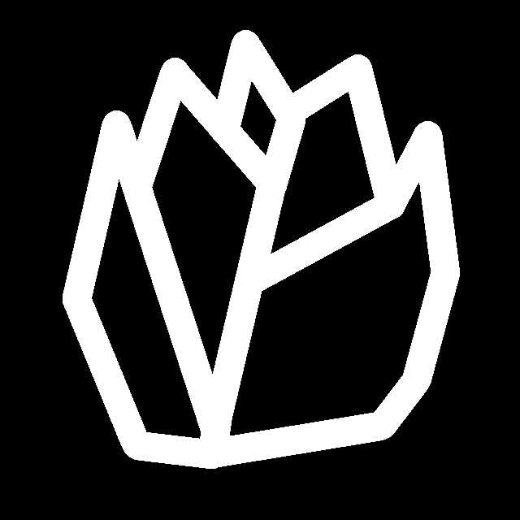

<div align="center">
  

  [](https://github.com/pmdroide/obsidian/stargazers)
  [](https://github.com/pmdroide/obsidian/network/members)
  [](https://github.com/pmdroide/obsidian/releases)
</div>

# Obsidian

Obsidian is a game engine royalty free with objective to make development easy and simple to understand.

## Getting started

### Prerequisites

- [Git](https://git-scm.com/)
- [Visual Studio Code](https://code.visualstudio.com/download)
- [.NET 10 SDK](https://dotnet.microsoft.com/en-us/download/dotnet/10.0)
- [DirectX 11](https://www.microsoft.com/en-us/download/details.aspx?id=17431)

### Building

```
# Clone repo
git clone https://github.com/pmdroide/obsidian.git

```

Once you've cloned the repo, run `bootstrap.bat` which will download the dependencies and build the engine.

## Contributing 
If you want to contribute to the engine, please check the [contributing guide](CONTRIBUTING.md).

## Documentation
See the documention [here](DOCUMENTATION.md).

## Star History

<a href="https://www.star-history.com/?repos=pmdroide%2Fobsidian&type=date&legend=top-left">
 <picture>
   <source media="(prefers-color-scheme: dark)" srcset="https://api.star-history.com/chart?repos=pmdroide/obsidian&type=date&theme=dark&legend=top-left" />
   <source media="(prefers-color-scheme: light)" srcset="https://api.star-history.com/chart?repos=pmdroide/obsidian&type=date&legend=top-left" />
   
 </picture>
</a>

## License
The obsidian engine source code is licensed under the [MIT License](LICENSE)